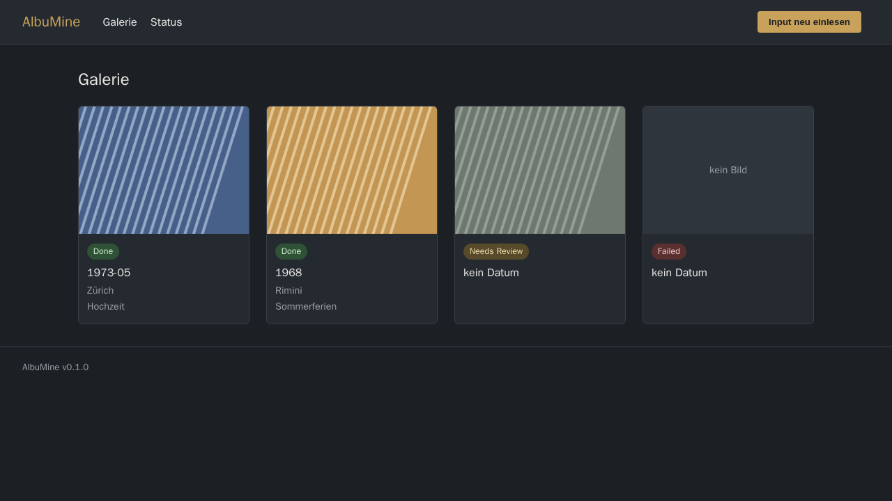

# AlbuMine

Selbst-hostbare Web-App zur **Digitalisierung und Anreicherung alter
Familienalben**.

<br clear="left">
 AlbuMine überwacht einen Ordner mit Foto-Scans und führt
**Duplex-Scans** — Vorderseite (das Foto) und Rückseite (handschriftliche Notiz
mit Datum/Ort/Personen) — automatisch zu einer einzigen, mit Metadaten
angereicherten Bilddatei zusammen.



## Schnellstart

```bash
docker compose up --build      # Web-App + ARQ-Worker + Redis
# Web-UI: http://localhost:8765
```

Für den Unraid-/Single-Container-Betrieb bringt das Image einen All-in-one-Modus
mit (Redis + Worker + Web in einem Container).

## Dokumentation

- **[docs/README.md](docs/README.md)** — Überblick, Features, Konfiguration
- **[docs/ARCHITECTURE.md](docs/ARCHITECTURE.md)** — Architektur, Workflow, Design-Entscheidungen
- **[docs/INSTALL-UNRAID.md](docs/INSTALL-UNRAID.md)** — Installation auf Unraid

## Lizenz

MIT
