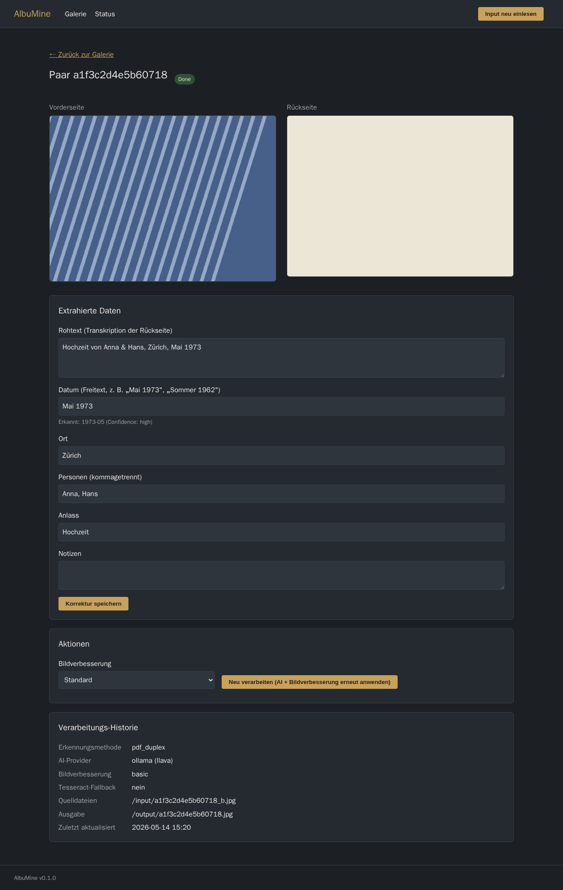
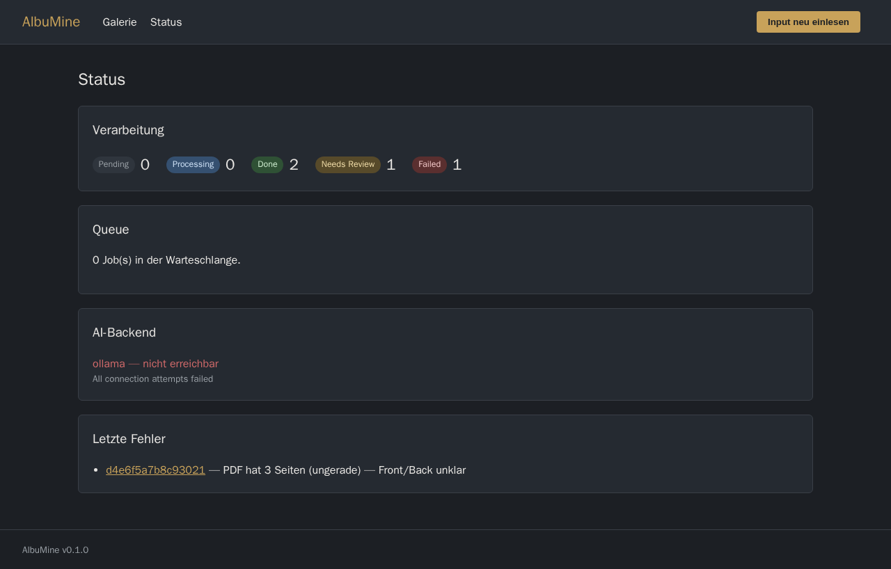
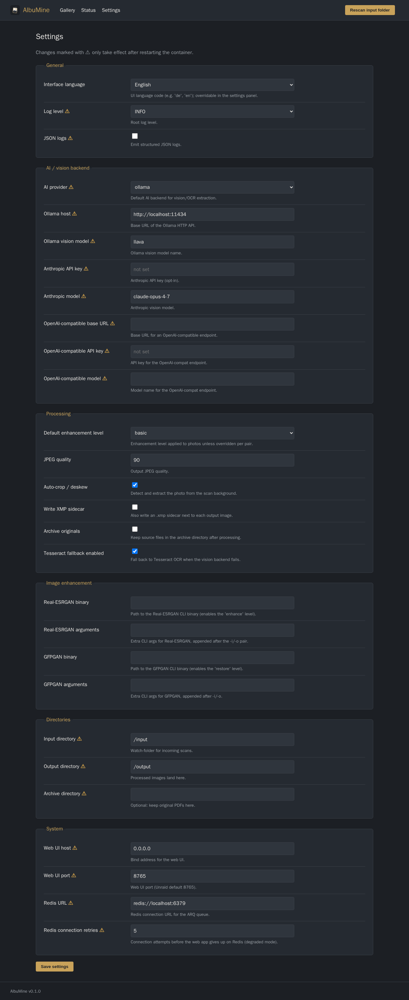

# AlbuMine

Selbst-hostbare Web-App zur **Digitalisierung und Anreicherung alter Familienalben**.

AlbuMine verarbeitet Foto-Scans aus einem Watch-Folder. Kernfeature:
**Duplex-Scans** — Vorderseite (das Foto) und Rückseite (handschriftliche Notiz
mit Datum/Ort/Personen) — werden automatisch zu einer einzigen, mit Metadaten
angereicherten Bilddatei zusammengeführt.

> Status: **funktionsfähiges MVP.** Alle neun geplanten Phasen sind umgesetzt,
> plus ein Web-Settings-Panel und mehrsprachige Oberfläche (16 Sprachen):
> Ingest, Pair-Detection, Datum-Parsing, ExifTool-Metadaten, austauschbarer
> Vision-LLM-Layer, End-to-End-Pipeline (CLI + ARQ-Worker), Web-UI,
> Bildverbesserungs-Stufen und das Unraid-Deployment.

## Screenshots

| Galerie | Detail & Korrektur | Status | Einstellungen |
|---------|--------------------|--------|---------------|
|  |  |  |  |

## Features

- Watch-Folder-Ingest mit Pair-Detection (PDF-Duplex, Bildpaare, manueller Override)
- Vision-LLM-Pipeline für handschriftliche Rückseiten (Ollama / Claude / OpenAI-kompatibel)
- Robustes Datum-Parsing für unvollständige Angaben („Sommer 1962", „ca. 1970")
- Metadaten-Schreiben via ExifTool (EXIF/IPTC/XMP + eigener `albumine`-Namespace)
- Web-UI: Galerie, manuelle Korrektur, Re-Processing, Status-Dashboard
- **Web-Settings-Panel** — alle Einstellungen im Browser editierbar (DB-Overlay
  über die ENV-Konfiguration), inkl. Secrets
- **Mehrsprachige Oberfläche** — 16 Sprachen, im Settings-Panel umschaltbar;
  neue Sprache = eine JSON-Datei
- Bildverbesserungs-Stufen: `none` → `basic` (Farbe/Kontrast) → `enhance`
  (Real-ESRGAN) → `restore` (GFPGAN), mit Graceful Degradation
- Resilienz: Tesseract-Fallback bei AI-Ausfall, Degraded-Modus ohne Redis
- Unraid Community Applications Template (All-in-one-Container)

## Tech-Stack

| Bereich        | Wahl                                              |
|----------------|---------------------------------------------------|
| Backend        | Python 3.12 + FastAPI                             |
| Frontend       | HTMX + Jinja2 (kein Build-Step)                   |
| Task-Queue     | ARQ (Redis-basiert)                               |
| Datenbank      | SQLite (SQLModel/SQLAlchemy)                      |
| Bildverarbeitung | Pillow, OpenCV, pdf2image, ExifTool             |
| OCR            | Vision-LLM primär, Tesseract als Fallback         |
| Container      | Multi-Stage Dockerfile auf `python:3.12-slim`     |

## Entwicklung (lokal)

Voraussetzung: Docker + Docker Compose.

```bash
# Stack bauen und starten (Web-App + ARQ-Worker + Redis als getrennte Services)
docker compose up --build

# Web-UI: http://localhost:8765        (Galerie, Korrektur, Status)
# Healthcheck: http://localhost:8765/healthz
```

Für Unraid / Single-Container-Betrieb bringt das Image einen **All-in-one-Modus**
mit (Redis + Worker + Web via supervisord in *einem* Container) — siehe
[INSTALL-UNRAID.md](INSTALL-UNRAID.md). `docker compose` überschreibt das pro
Service und nutzt stattdessen die getrennten Prozesse.

Ohne Container, direkt mit Python:

```bash
pip install -e ".[dev]"
albumine            # Web-UI: startet uvicorn auf ALBUMINE_WEBUI_PORT (Default 8765)
albumine-worker     # ARQ-Worker (Bildverarbeitung, braucht Redis)
albumine-cli scan   # Pipeline einmalig über den Input-Ordner laufen lassen
albumine-cli list   # verarbeitete Scans anzeigen
albumine-cli health # AI-Provider-Status prüfen
pytest              # Tests
```

## Konfiguration

Die **Basiskonfiguration** kommt aus Environment-Variablen (Präfix
`ALBUMINE_`). Siehe [`config.py`](../src/albumine/config.py) für die
vollständige Liste. Wichtige Variablen:

| Variable                  | Default                  | Bedeutung                          |
|---------------------------|--------------------------|------------------------------------|
| `ALBUMINE_WEBUI_PORT`     | `8765`                   | Port der Web-UI                    |
| `ALBUMINE_UI_LANGUAGE`    | `de`                     | Start-Sprache der Oberfläche       |
| `ALBUMINE_REDIS_URL`      | `redis://localhost:6379` | Redis für die ARQ-Queue            |
| `ALBUMINE_AI_PROVIDER`    | `ollama`                 | `ollama` \| `anthropic` \| `openai_compat` |
| `ALBUMINE_OLLAMA_HOST`    | `http://localhost:11434` | Ollama HTTP-API                    |
| `PUID` / `PGID` / `UMASK` | `99` / `100` / `022`     | Unraid-Benutzer-Mapping            |

Zur **Laufzeit** lassen sich (fast) alle Einstellungen im Web-Settings-Panel
(`/settings`) ändern — diese Overrides werden in der SQLite-DB gespeichert und
liegen über der ENV-Basis. Verhaltens-Einstellungen (Sprache, Bildverbesserung,
JPEG-Qualität …) wirken sofort; AI-Provider, Pfade und Ports brauchen einen
Container-Neustart (im Panel mit ⚠ markiert). `config_dir` ist bewusst nur per
ENV setzbar — dort liegt die Datenbank selbst.

## Dokumentation

- [INSTALL-UNRAID.md](INSTALL-UNRAID.md) — Installation auf Unraid
- [ARCHITECTURE.md](ARCHITECTURE.md) — Architektur und Workflow

## Lizenz

MIT
